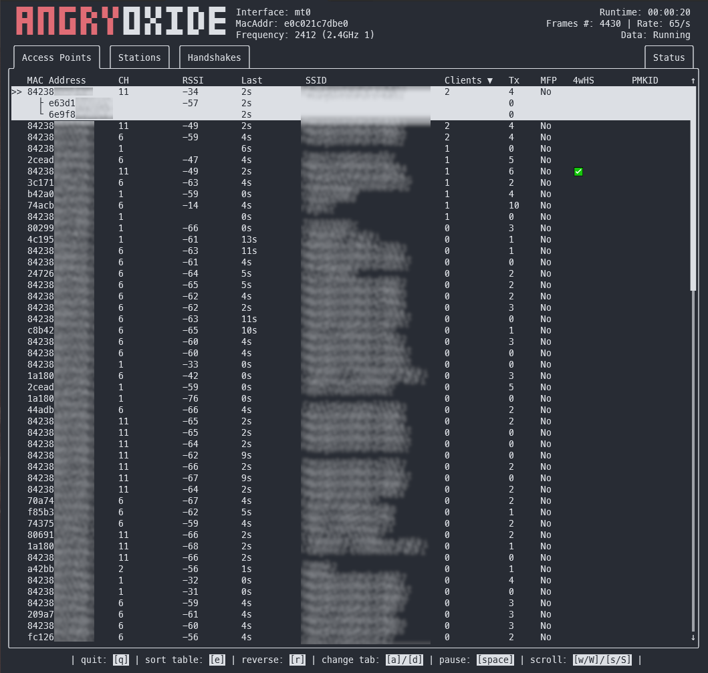
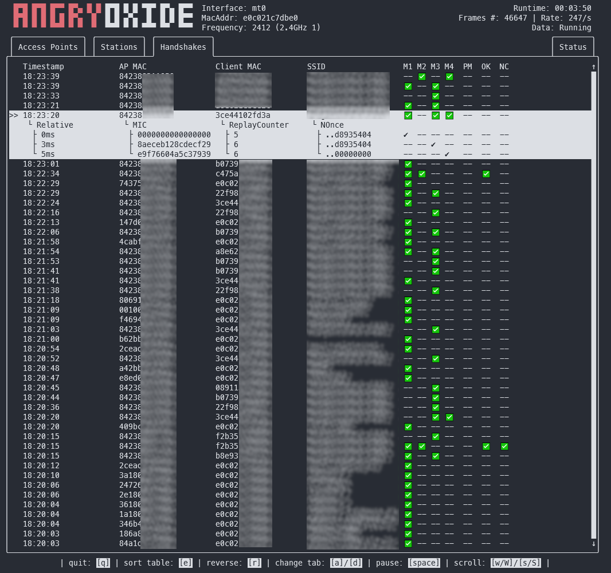
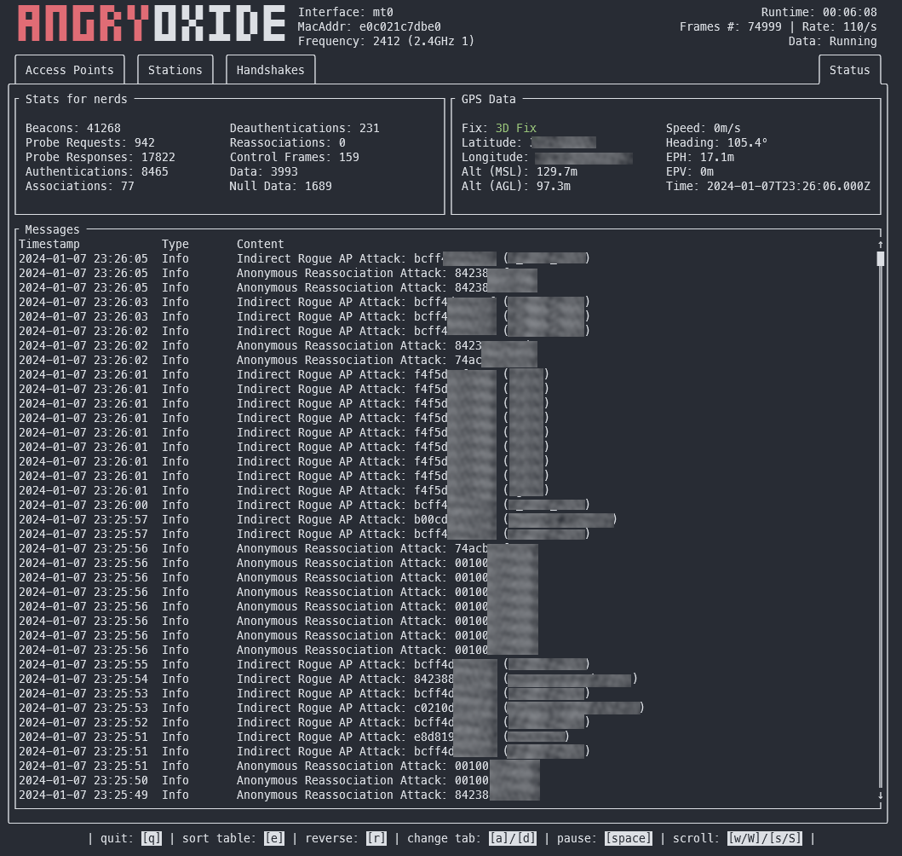

# AngryOxide 😡


### A 802.11 Attack tool built in Rust 🦀 !

[](https://github.com/Ragnt/AngryOxide/actions/workflows/ci.yml)  ](https://img.shields.io/discord/1194365883099922643)

AngryOxide was developed as a way to learn Rust, netlink, kernel sockets, and WiFi exploitation all at once.

NOTE: This project is under HEAVY development and you can expect a very fast release cycle.

The overall goal of this tool is to provide a single-interface survey capability with advanced automated attacks that result in valid hashlines you can crack with [Hashcat](https://hashcat.net/hashcat/).

This tool is heavily inspired by [hcxdumptool](https://github.com/ZerBea/hcxdumptool) and development wouldn't have been possible without help from ZerBea.

## I wanna use it!

You can download pre-compiled binaries of AngryOxide in the [releases](https://github.com/Ragnt/AngryOxide/releases/latest).

More architectures will be added as I confirm there is no endianess-related issues associated with them.

## Features

- Active state-based attack engine used to retrieve relevent EAPOL messages from Access Points and clients.
- Target option that accepts MAC (aabbcc..., aa:bb:cc...) and SSID "Test_SSID" to limit attack scope.
- A Terminal-UI that presents all relevent data while still living in the terminal for easy usage over SSH.
- Limits DEAUTHENTICATION frames that can cause more damage than good to the authentication sequence.
- EAPOL 4-Way-Handshake validation using Nonce Correction, Replay Counter validation, and Temporal validation.
- Automatically elicits PMKID from access points where available.
- Utilizes GPSD with ability to set remote GPSD service address.
- Provides pcapng files with embedded GPS using the [Kismet Format](https://www.kismetwireless.net/docs/dev/pcapng_gps/).
- Provides a kismetdb file with all frames (with GPS) for post-processing.
- Wraps all output files in a gzipped tarball.
- Bash autocompletions for easy interface selection provided.

## Attacks

Will by default attack ALL access points in range, unless atleast one target is supplied, at which point the tool will only transmit against defined targets. (But will still passively collect on other access points).

- Attempts authentication/association sequence to produce EAPOL Message 1 (PMKID Collection)
- Attempts to retrieve hidden SSID's with undirected probe requests.
- Utilized Anonymous Reassociation to force Access Points to deauthenticate their own clients (MFP Bypass)
- Attempts to downgrade RSN modes to WPA2-CCMP (Probe Response Injection)
- Attempts to collect EAPOL M2 from stations based solely on Probe Requests (Rogue AP)
- Will send controlled deauthentication frames unless told not to (--nodeauth)

All of these attacks are rate-controlled both to prevent erroneous EAPOL timer resets and to maintain some level of OPSEC.

## Help

```bash
❯ sudo angryoxide --help
Does awesome things... with wifi.

Usage: angryoxide [OPTIONS] --interface <INTERFACE>

Options:
  -i, --interface <INTERFACE>  Interface to use
  -c, --channel <CHANNEL>      Optional - Channel to scan. Will use "-c 1 -c 6 -c 11" if none specified
  -b, --band <BAND>            Optional - Entire band to scan - will include all channels interface can support
  -t, --target <TARGET>        Optional - Target (MAC or SSID) to attack - will attack everything if none specified
  -o, --output <OUTPUT>        Optional - Output filename
  -r, --rogue <ROGUE>          Optional - Tx MAC for rogue-based attacks - will randomize if excluded
      --gpsd <GPSD>            Optional - Alter default HOST:Port for GPSD connection [default: 127.0.0.1:2947]
      --headless               Optional - Set AO to headless mode without a UI. (useful with --autoexit)
      --autoexit               Optional - AO will auto-exit when all targets have a valid hashline
      --notransmit             Optional - Do not transmit - passive only
      --nodeauth               Optional - Do NOT send deauths (will try other attacks only)
      --notar                  Optional - Do not tar output files
  -h, --help                   Print help
```

## Building from source

If you want to build from source instead of using precompiled binaries, these are the basic instructions:

```
# Install Rust
curl --proto '=https' --tlsv1.2 -sSf https://sh.rustup.rs | sh

# Clone this repo
git clone https://github.com/Ragnt/AngryOxide.git

# Build/Install
cd AngryOxide
make
sudo make install
```

This will build from source, install into /usr/bin/angryoxide, and install the bash completions for you.

### Cross compiling:

I use [cross](https://github.com/cross-rs/cross) to cross compile to embedded architectures.

Here is MIPS as an example, which builds by also building the standard library.

```cross build +nightly --target mips-unknown-linux-musl --release -Zbuild-std```

### Bash completion script:

You can use `pkg-config --variable=completionsdir bash-completion` to determine where the completions script should be installed.

I use [zsh-bash-completions-fallback plugin](https://github.com/3v1n0/zsh-bash-completions-fallback) to enable the bash autocompletion file zsh.


## Screenshots!




