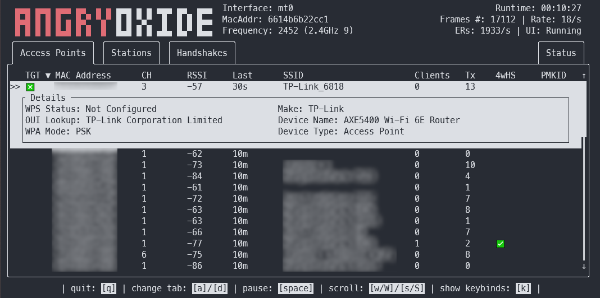
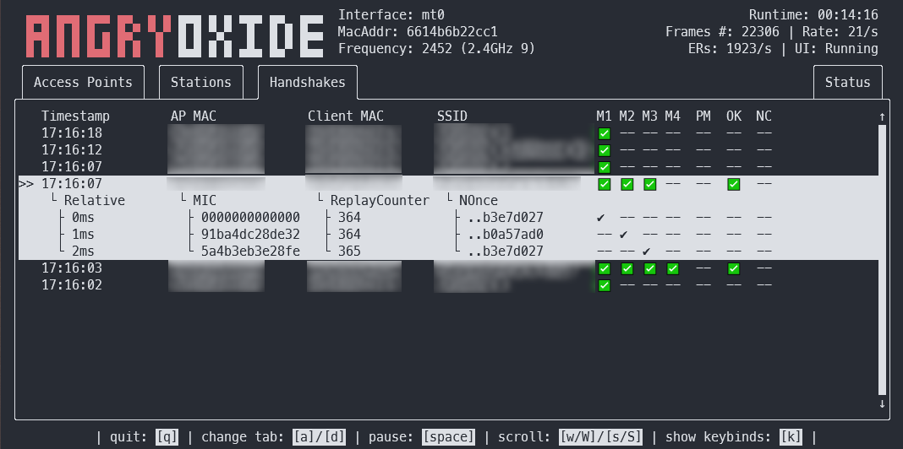

# AngryOxide 😡


### A 802.11 Attack tool built in Rust 🦀 !

[](https://github.com/Ragnt/AngryOxide/actions/workflows/ci.yml)  [](https://discord.gg/QsEgaFndsQ)

**This tool is for research purposes only. I am not responsible for anything you do or damage you cause while using AngryOxide. Only use against networks that you have permission.**

AngryOxide was developed as a way to learn Rust, netlink, kernel sockets, and WiFi exploitation all at once.

You can get information about how to use AngryOxide in the [User Guide](https://github.com/Ragnt/AngryOxide/wiki/1.-User-Guide).

NOTE: This project is under HEAVY development and you can expect a very fast release cycle.

The overall goal of this tool is to provide a single-interface survey capability with advanced automated attacks that result in valid hashlines you can crack with [Hashcat](https://hashcat.net/hashcat/).

This tool is heavily inspired by [hcxdumptool](https://github.com/ZerBea/hcxdumptool) and development wouldn't have been possible without help from ZerBea.

If you have questions or any issues, you can reach me on the [AngryOxide Discord](https://discord.gg/QsEgaFndsQ)

## I wanna use it!

You can download pre-compiled binaries of AngryOxide in the [releases](https://github.com/Ragnt/AngryOxide/releases/latest).

```bash
tar -xf angryoxide-linux-x86_64.tar.gz # Untar
chmod +x install # Make executable
sudo install install # Install (as root, including zsh/bash completions)
```

You can get information about how to use AngryOxide in the [User Guide](https://github.com/Ragnt/AngryOxide/wiki/1.-User-Guide).


## Features

- Active state-based attack engine used to retrieve relevent EAPOL messages from Access Points and clients.
- Target option that accepts MAC (aabbcc..., aa:bb:cc...) and SSID "Test_SSID" to limit attack scope.
- Whitelist option to protect specific networks from attacks. Useful if not using targets.
- Auto Hunt capability to find all target channels and hop between them.
- A Terminal-UI that presents all relevent data while still living in the terminal for easy usage over SSH.
- Limits DEAUTHENTICATION frames that can cause more damage than good to the authentication sequence.
- EAPOL 4-Way-Handshake validation using Nonce Correction, Replay Counter validation, and Temporal validation.
- Automatically elicits PMKID from access points where available.
- Utilizes GPSD with ability to set remote GPSD service address.
- Provides pcapng files with embedded GPS using the [Kismet Format](https://www.kismetwireless.net/docs/dev/pcapng_gps/).
- Provides a kismetdb file with all frames (with GPS) for post-processing.
- Wraps all output files in a gzipped tarball.
- Bash autocompletions for easy interface selection provided.

## Attacks

Will by default attack ALL access points in range, unless atleast one target is supplied, at which point the tool will only transmit against defined targets. (But will still passively collect on other access points).

- Attempts authentication/association sequence to produce EAPOL Message 1 (PMKID Collection)
- Attempts to retrieve hidden SSID's with undirected probe requests.
- Utilizes Anonymous Reassociation to force Access Points to deauthenticate their own clients (MFP Bypass)
- Will attempt to send Channel Switch Announcement to send clients to adjacent channels.
- Attempts to downgrade RSN modes to WPA2-CCMP (Probe Response Injection)
- Attempts to collect EAPOL M2 from stations based solely on Probe Requests (Rogue AP)
- Will send controlled deauthentication frames unless told not to (--nodeauth)

All of these attacks are rate-controlled both to prevent erroneous EAPOL timer resets and to maintain some level of OPSEC.

## Help

```
❯ angryoxide --help
Does awesome things... with wifi.

Usage: angryoxide [OPTIONS] --interface <INTERFACE>

Options:
  -i, --interface <INTERFACE>     Interface to use
  -c, --channel <CHANNEL>         Optional - Channel to scan. Will use "-c 1,6,11" if none specified
  -b, --band <2 | 5 | 6 | 60>     Optional - Entire band to scan - will include all channels interface can support
  -o, --output <Output Filename>  Optional - Output filename
  -h, --help                      Print help
  -V, --version                   Print version

Targeting:
  -t <MAC Address or SSID>          Optional - Target (MAC or SSID) to attack - will attack everything if none specified
  -w <MAC Address or SSID>          Optional - Whitelist (MAC or SSID) to NOT attack
      --targetlist <Targets File>   Optional - File to load target entries from
      --whitelist <Whitelist File>  Optional - File to load whitelist entries from

Advanced Options:
  -r, --rate <1 | 2 | 3>              Optional - Attack rate (1, 2, 3 || 3 is most aggressive) [default: 2]
      --combine                       Optional - Combine all hc22000 files into one large file for bulk processing
      --noactive                      Optional - Disable Active Monitor mode
      --rogue <MAC Address>           Optional - Tx MAC for rogue-based attacks - will randomize if excluded
      --gpsd <IP:PORT>                Optional - Alter default HOST:Port for GPSD connection [default: 127.0.0.1:2947]
      --autohunt                      Optional - AO will auto-hunt all channels then lock in on the ones targets are on
      --headless                      Optional - Set the tool to headless mode without a UI. (useful with --autoexit)
      --autoexit                      Optional - AO will auto-exit when all targets have a valid hashline
      --notransmit                    Optional - Do not transmit - passive only
      --nodeauth                      Optional - Do NOT send deauths (will try other attacks only)
      --notar                         Optional - Do not tar output files
      --dwell <Dwell Time (seconds)>  Optional - Adjust channel hop dwell time [default: 2]
```

## Building from source

If you want to build from source instead of using precompiled binaries, these are the basic instructions:

```
# Install Rust
curl --proto '=https' --tlsv1.2 -sSf https://sh.rustup.rs | sh

# Clone this repo
git clone https://github.com/Ragnt/AngryOxide.git

# Build/Install
cd AngryOxide
make
sudo make install
```

This will build from source, install into /usr/bin/angryoxide, and install the bash completions for you.

### Cross compiling:

I use [cross](https://github.com/cross-rs/cross) to cross compile to embedded architectures.

Here is MIPS (mips-unknown-linux-musl) as an example.

```
# make sure you have the nightly installed
rustup install nightly

# dynamically linked & soft-float
cross build +nightly --target mips-unknown-linux-musl --release -Zbuild-std
```


### Completions script:

These make using AngryOxide with bash and zsh a bit more fluid, automatically finding your wireless interfaces for you and showing you the arguments in a tab-completable way.

## Screenshots!



